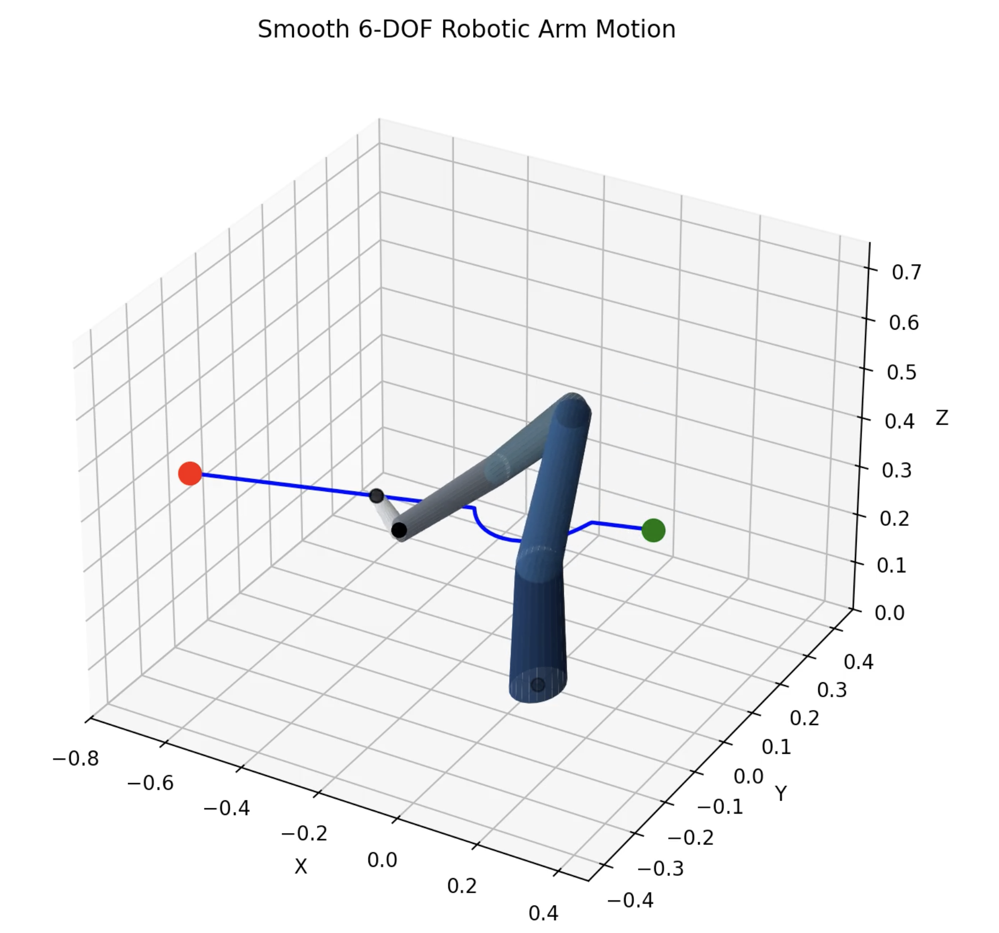

# Robotic Arm Simulation in Python

Python-based 6-DOF robotic arm simulation with:

- Forward and inverse kinematics
- Jacobian-based motion control
- Smooth trajectory planning
- Reachability and workspace analysis
- 3D visualization and animation
- Monte Carlo workspace sampling
- Singular configuration analysis
- Tapered industrial-style robotic arm rendering

The project uses Denavit–Hartenberg (DH) transformations and damped least-squares inverse kinematics to simulate realistic robotic arm motion and end-effector trajectories.

## Features

- Smooth end-effector path generation
- Real-time animated 3D visualization
- Workspace computation and reachability validation
- Jacobian rank analysis
- MP4 animation export support
- Multi-link tapered arm geometry

## Example Visualization



## Project Structure

```text
robotic-arm-simulation-python/
├── src/
├── assets/
│   └── visualization.png
├── arm_sim.py
├── different_arm.py
├── reachability_region.py
├── requirements.txt
└── README.md
```

## Installation

```bash
pip install numpy matplotlib
```

## Run

```bash
python different_arm.py
```

## Mathematical Foundations

The simulator includes:

- Denavit–Hartenberg kinematics
- Homogeneous transformation matrices
- Jacobian computation
- Damped least-squares inverse kinematics
- Workspace estimation using Monte Carlo sampling

## Future Work

- Collision avoidance
- Dynamics and torque simulation
- Reinforcement learning control
- ROS integration
- Real robotic arm hardware support# robotic-arm-simulation
Python-based robotic arm simulation with kinematics, trajectory planning, and visualisation.
